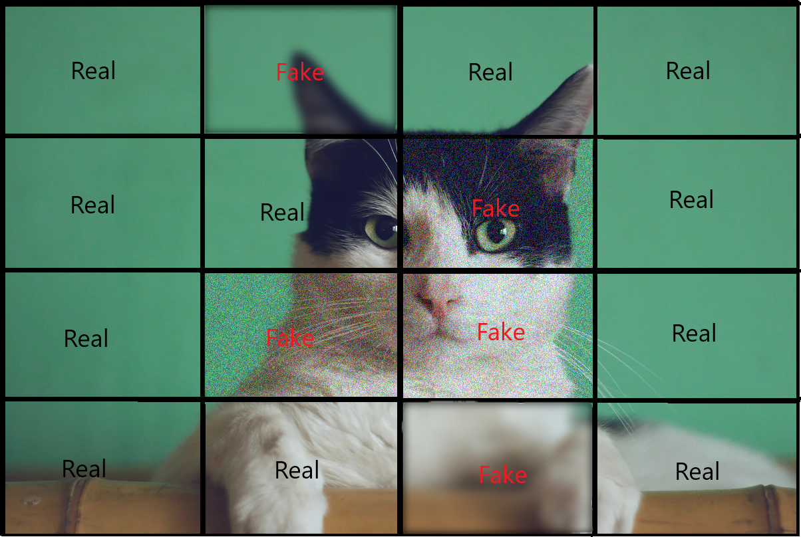
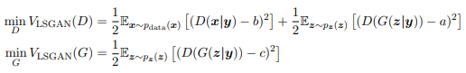
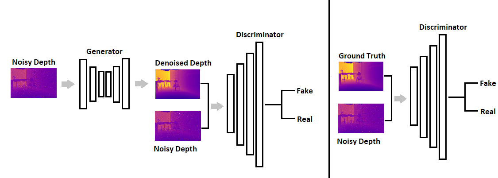
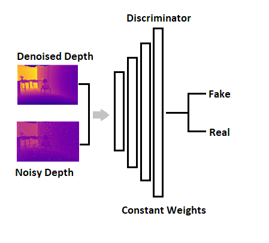

# Pix2Pix-PyTorch
 
This repo contains a simplified implementation of pix2pix which is one of my favourite GANs. It contains a very basic and straightforward implementation. I briefly discuss some concepts below, feel free to ask questions!

Original Paper: [Image-to-Image Translation with Conditional Adversarial Networks](https://arxiv.org/pdf/1611.07004.pdf) 

Status: *Finished*

## Setup

```shell
conda install pytorch=1.3.1 torchvision=0.2.1 -c pytorch
pip install tensorboardX==1.4
pip install easydict
```

#### Dataset
Use this [link](https://people.eecs.berkeley.edu/~tinghuiz/projects/pix2pix/datasets/) to download the datasets. There are multie choices available, however, I only
tried to use the facades dataset owing to its small size. 

Specify the absolute data path in the config file in the DATA section.

You can also specify which direction of image translation. For example the two possible directions in the maps dataset are: 
1. RGB Sattelite - > Maps  
2. Maps -> RGB Sattelite

#### Training
All the hyperparameters can be set in the config file. Here you can set the data path and log path too.

Run the training loop using the command:
```shell
python training/main.py --config_path path_to_config
```

To check tensorboard
```shell
tensorboard --logdir path_to_logs/train
```

#### Testing

You can test results by using the following command:

```shell
python testing/test.py --config_path path_to_config
```

Set the plot flag in configs if you would like to see the respective input and output.

## Discussion
The generator and discriminator in a GAN network can be conditioned
on extra information. While GANs model the joint probability distribution P(x, y), cGANs
model the conditional probability P(x|y). This can be done by adding an extra feature vector
which encodes the information i.e. which class an image belongs to (labels), or specic features
that we are trying to produce. Moreover, GANs produce random outputs where as in cGAN
output can be specied. This gives us the benet of directing the output of the GAN to our
requirements.

### Generator
The architecture of the generator usually depends on the appropriate type of data it will
produce. In the case of images, we usually consider the convolutional neural networks like
Resnets, U-Net etc. The generator learns to produce realistic data distribution with which it tries to
fool the discriminator. This repositary uses a basic U-Net with skip connections. 

### Markovian Discriminator (PatchGAN)
A PatchGAN is a discriminator architecture which penalizes structure within a certain patch and classifies if each patch is real or fake. 
The PatchGAN architecture consists of fully convolutional layers, hence the output is a feature map consisting of classification (real or fake) of the patch. 
The values in the feature maps are like probabilities of being real or fake. The size of the patches can be controlled with the number of layers and strided convolutions in the discriminator. 
Intuitively, less layers result in large feature maps hence large patches and more layers result in smaller patches. The smallest patch size is 1x1 and the largest patch size is the image size for square images. 
The advantage of such a discriminator is that it models the image as a Markov random field, where the pixels are independent when they are separated by more than a patch diameter. 
Therefore, great emphasis is put on style and texture of the image. 

<p align="center">
  
</p>


### Loss Functions 
L2 is a popular loss for image processing tasks but it produces blurry results and does not correlate well with image quality as humans perceive it. In comparison, the L1 loss has improved performance but it's still not optimal. Both of these losses do not encourage high-frequency crispness but they do capture low frequencies well. Therefore, pix2pix uses L1 for correctness at low frequencies and restricts the PatchGAN for structure at high frequencies. For modelling high frequencies, the focus is restricted to structure in local image patches. 

The loss that the PatchGAN uses is from [LSGAN](https://arxiv.org/pdf/1611.04076.pdf). The loss function is able to move the fake samples closer to the decision boundary between real and fake samples. LSGAN moves the fake samples closer to the real samples since the loss function penalizes samples that lie too far from the decision boundary on the correct side. If the samples are on the correct side of the decision boundary but still far from the real data, they tend to suffer from vanishing gradient problem. LSGAN remedies this problem since it forces far samples to be closer. 

<p align="center">
  
</p>

In the equation above, a is the fake sample and b is the real sample, and c is the value that the generator wants the discriminator to believe for fake data.  

### Training Procedure

#### Discriminator

<p align="center">
  
</p>

The above image shows the discriminator training process. 
The first part on the left consists of the discriminator's training on generator's fake generated images. 
The generator takes in an input image and produces a fake image. 
This generated fake image is pairted with the input image and passed through the discriminator for a classification. 
The loss obtained is the discriminator's loss on fake images. The second part consists of discriminator's training on real images. 
The ground truth real image is paired with the input and passed through the discriminator for a classification. 
The loss obtained is the discriminator's loss on real images. When computing the loss for the discriminator, 
the discriminator is aware if its looking at real image or a fake image therefore it updates based on its performance by taking the average of the two losses. 

#### Generator
<p align="center">
  
</p>

The generator's training procedure is similar, however the discriminator's weights are kept constant otherwise it would be 
like hitting a moving target. For the generator's GAN based training we take the fake output and pair it with the input and 
pass it through the discriminator. Note that this would be different from before as the discriminator's weights have been updated. 
The L1 loss for the generator is also computed between the fake output and the groundtruth image. 
The L1 loss is weighted 100 times more than the generator's LSGAN loss. The sum of the two losses is used to update the generator's weights.


### Stability Measures
The GAN framework is highly unstable but several tricks can be used to stabilize it. This
section will present some measures undertaken to ensure stable training. Most of these focus
on making the discriminator weaker in order to ensure that the generator's gradients do not
vanish which was usually the case without these measures.

#### One-Sided Label Smoothing
Label smoothing is an old technique which has recently proved to reduce the weakness of neural networks to adversarial examples. 
Without label smoothing a classifier makes very confident predictions on the training data. When the values are outside where the training data is concentrated, 
the model linearly extrapolates to make extreme predictions which hurts the test and adversarial accuracy. This technique will penalize the discriminator when its too confident about its predictions. 
If values are outside the main concentration of training data then the discriminator is forced to learn non-linear functions with lower confidence. In short, label smoothing prevents extreme extrapolations. 
We do one sided label smoothing because where the probability distribution of data is almost zero and probability distribution of model is large, 
the incorrect samples from the distribution of the model have no incentive to move closer to data. Practically, we soften the real label to be randomly between (0.8, 1.2) in the discriminator's GAN loss function. 
You can read more on the topic [ Improved Techniques for Training GANs section 3.4](https://arxiv.org/pdf/1606.03498.pdf).

#### Label Switching
Since the discriminator is strong during the early stages of training, it is recommended to
make the labels noisy. Occasionally we switch the labels of the real and fake images in order
to weaken the discriminator. It is important to nd a good schedule to switch the labels as
too much noise can lead to inecient training. You can read more on the topic [here](https://github.com/soumith/ganhacks).

#### Adding Noise To Inputs
Some researchers have suggested to include artifical decaying gaussian white noise to the inputs of the discriminator so that its job becomes more difficult. 
There is good article about it by [Ferenc Huszar](https://www.inference.vc/instance-noise-a-trick-for-stabilising-gan-training/). This [paper](https://openreview.net/pdf?id=Hk4_qw5xe) also 
provides good insight into this issue.

## Disclaimer
Some parts of code has been adopted from [Junyaz's PyTorch Implementation](https://github.com/junyanz/pytorch-CycleGAN-and-pix2pix).